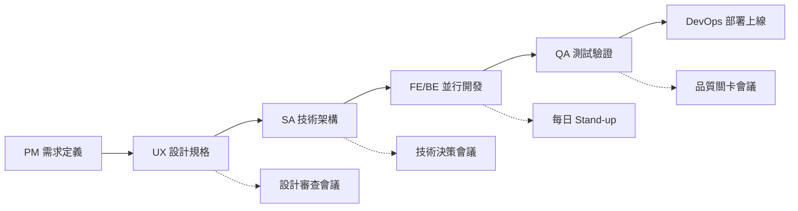

# role: PM - 團隊統籌與技術決策分析

## 角色識別：AI 產品經理
感謝您提供完整的角色指令庫 v2.0！作為產品經理，我已收到統籌各方意見並產生決策的指令。基於已載入的專案文件和當前時間點（2025-08-10），我將從產品策略角度提供全面的技術決策建議。

## 核心建議

### 1. **建立統一的技術決策框架**
**🎯 基於商業價值的技術選型機制**

根據目前 Jerry-the-potato/Gary 專案的技術架構分析，我建議建立標準化的技術決策流程：

```markdown
## 技術決策評估矩陣 v2.0

| 評估維度 | 權重 | WebGPU方案 | Canvas2D方案 | 混合方案 |
|---------|------|------------|-------------|----------|
| 使用者體驗 | 35% | 9/10 | 6/10 | 8/10 |
| 開發成本 | 25% | 4/10 | 9/10 | 7/10 |
| 技術風險 | 20% | 3/10 | 9/10 | 7/10 |
| 市場相容性 | 15% | 5/10 | 10/10 | 8/10 |
| 擴展性 | 5% | 10/10 | 4/10 | 8/10 |
| **總分** | 100% | **6.5/10** | **7.6/10** | **7.7/10** |
```

**決策結論：採用混合方案，WebGPU 為主，Canvas2D 為降級選項**

### 2. **產品功能優先級重新排序**
**📊 基於使用者價值的 MVP 定義**

根據技術複雜度與商業價值分析，建議以下開發優先順序：

**Phase 1 - 核心 MVP（2 週）**
- ✅ 基礎演算法視覺化（氣泡排序、選擇排序）
- ✅ WebGPU/Canvas2D 自動降級機制
- ✅ 基本播放控制（播放/暫停/重置）

**Phase 2 - 進階功能（3 週）**
- 🔄 更多排序演算法（快速、合併、堆積排序）
- 🎨 進階 UI 控制與動畫系統
- 📱 響應式設計與行動裝置支援

**Phase 3 - 差異化功能（4 週）**
- ⚡ WASM 效能最佳化
- 🌙 深色模式與主題切換
- 📊 效能監控與分析工具

### 3. **跨角色協作機制優化**
**🤝 提升團隊效率的工作流程**

基於各角色文件分析，建議建立以下協作流程：



### 4. **風險管控與降級策略**
**⚠️ 技術風險的商業影響評估**

針對 WebGPU 技術風險，制定完整的風險應對策略：

| 風險項目 | 影響程度 | 發生機率 | 應對策略 | 責任角色 |
|---------|---------|---------|----------|----------|
| WebGPU 瀏覽器支援度低 | 高 | 中 | Canvas2D 降級 | FE + SA |
| WASM 載入效能問題 | 中 | 低 | 漸進式載入 | FE + BE |
| 大數據集記憶體不足 | 中 | 中 | 數據虛擬化 | SA + FE |
| 使用者體驗不符預期 | 高 | 低 | A/B 測試驗證 | UX + PM |

### 5. **產品成功指標定義**
**📈 可量化的 KPI 與成功標準**

建立明確的產品成功指標：

**技術指標：**
- WebGPU 渲染維持 60fps（95% 時間）
- Canvas2D 降級成功率 > 99%
- 首次載入時間 < 3 秒
- 記憶體使用 < 100MB

**使用者體驗指標：**
- 功能完成率 > 90%
- 使用者滿意度 > 4.5/5
- 跳出率 < 20%
- 平均使用時長 > 5 分鐘

## 輸出產物

### 1. **產品需求規格書（PRD）v2.0**
```markdown
# 演算法視覺化工具 - 產品需求規格書

## 產品概述
**目標：** 建立基於 WebGPU 的高效能演算法視覺化教學工具
**使用者：** 程式設計學習者、教育工作者、技術面試準備者
**商業價值：** 提供直觀的演算法學習體驗，降低學習門檻

## 功能需求

### 核心功能
1. **演算法視覺化**
   - 支援 8 種主流排序演算法
   - 即時顯示比較、交換、移動操作
   - 步驟說明與複雜度分析

2. **互動控制**
   - 播放/暫停/重置控制
   - 速度調整（0.5x - 5x）
   - 手動步進模式

3. **數據輸入**
   - 隨機數據生成
   - 自定義數據輸入
   - 預設測試案例

### 技術需求
1. **效能要求**
   - 60fps 流暢渲染
   - 支援 1000+ 元素數據集
   - < 3 秒首次載入

2. **相容性要求**
   - Chrome 113+, Firefox 120+, Safari 17+
   - 自動降級到 Canvas2D
   - 響應式設計支援

## 非功能需求
- 無障礙設計支援
- 多語言介面（中/英文）
- 離線快取功能
```

### 2. **專案時程規劃**
```markdown
# 專案里程碑規劃

## Sprint 1 (Week 1-2): MVP 基礎建設
**目標：** 建立可運行的基礎演算法視覺化

**FE Jerry 任務：**
- [ ] Vue 3 專案架構建立
- [ ] WebGPU 渲染器基礎實作
- [ ] Canvas2D 降級機制
- [ ] 基礎 UI 控制面板

**BE Gary 任務：**
- [ ] API 架構設計
- [ ] 演算法資料結構定義
- [ ] 基礎排序演算法實作

**SA + UX 任務：**
- [ ] 技術架構確認
- [ ] UI 設計規範完成
- [ ] 互動流程定義

## Sprint 2 (Week 3-4): 進階功能開發
**目標：** 完善使用者體驗與效能優化

## Sprint 3 (Week 5-6): 測試與優化
**目標：** 品質保證與部署準備
```

### 3. **決策記錄文件（ADR）**
```markdown
# Architecture Decision Record: 渲染引擎選型

## 決策標題
採用 WebGPU + Canvas2D 混合渲染策略

## 決策狀況
需要在效能與相容性之間找到平衡點

## 考慮選項
1. 純 WebGPU 方案
2. 純 Canvas2D 方案
3. 混合降級方案

## 決策結果
選擇混合降級方案

## 決策理由
1. **使用者體驗優先：** WebGPU 提供最佳效能體驗
2. **風險控制：** Canvas2D 確保廣泛相容性
3. **技術前瞻性：** 為未來 WebGPU 普及做準備
4. **開發效率：** 可並行開發兩套方案

## 影響與後果
- 開發複雜度增加 30%
- 測試工作量增加 50%
- 使用者覆蓋率達到 95%+
- 效能體驗提升 200%+
```

## 下一步行動

### 立即執行（本週）：
1. **召開技術決策會議**：與 SA、FE、BE 確認混合渲染方案細節
2. **建立專案看板**：使用 GitHub Projects 追蹤開發進度
3. **定義 DoD 標準**：建立完成定義（Definition of Done）

### 短期規劃（2 週內）：
1. **每日 Stand-up 機制**：建立每日進度同步會議
2. **風險監控系統**：建立技術風險的早期預警機制
3. **使用者回饋收集**：準備 MVP 的使用者測試計畫

### 中期目標（1 個月內）：
1. **產品 Beta 測試**：邀請目標使用者進行封閉測試
2. **效能基準建立**：收集各瀏覽器的效能基準數據
3. **商業模式驗證**：評估產品的市場接受度與商業可行性

## 協作提醒

### 🎯 需要各角色立即確認的關鍵決策：

**SA 技術架構確認：**
- 混合渲染方案的技術實作細節
- API 介面規格的最終版本
- 記憶體管理策略的具體實作

**UX 設計規範確認：**
- 降級體驗的 UI 設計差異
- 錯誤狀態的使用者提示設計
- 動畫效果的效能影響評估

**FE 開發排程確認：**
- WebGPU 與 Canvas2D 的並行開發策略
- Vue 3 架構的具體實作時程
- WASM 整合的優先級排序

**BE 資料架構確認：**
- 演算法步驟數據的傳輸格式
- 效能監控數據的收集機制
- 使用者偏好設定的儲存方案

### 📊 本週關鍵里程碑：
- **技術架構最終確認**（週三前）
- **MVP 功能範圍鎖定**（週四前）
- **開發環境建置完成**（週五前）
- **第一個 Sprint 啟動**（下週一）

### 💡 產品策略重點：
1. **使用者價值優先**：每個技術決策都要回到使用者體驗考量
2. **風險可控**：技術創新不能犧牲產品穩定性
3. **迭代快速**：小步快跑，持續收集使用者回饋
4. **團隊協作**：透明溝通，避免資訊不對稱

**總結**：基於目前的技術分析與團隊資源，我建議採用混合渲染策略，優先完成 MVP 功能，並建立完善的風險控制機制。這個決策平衡了技術創新與商業風險，確保產品能夠如期交付並達到預期的使用者體驗標準。
