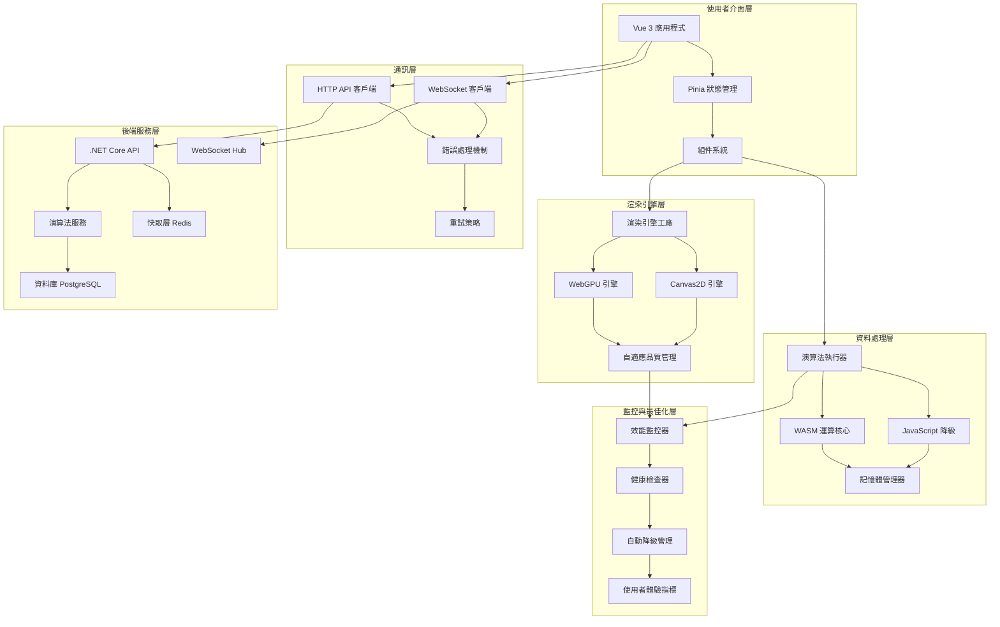

# role: SA - 系統架構技術規格確認與補強

**角色識別：** AI 系統分析師 - 專注於技術架構深度分析與系統設計完善

## 核心建議

### 1. **PM 統籌決策的技術架構確認**
**✅ 混合渲染方案的系統架構完善**

PM 提出的混合渲染策略在技術架構上是合理的，但需要補強以下技術細節：

```typescript
// 統一的渲染抽象層架構
interface RenderingSystemArchitecture {
  // 核心渲染引擎介面
  renderingEngine: {
    detection: {
      webgpu: () => Promise<boolean>,
      canvas2d: () => boolean,
      fallbackChain: ['webgpu', 'canvas2d']
    },

    initialization: {
      webgpu: {
        deviceSelection: 'high-performance' | 'low-power',
        features: ['timestamp-query', 'texture-compression-bc'],
        limits: {
          maxBufferSize: 256 * 1024 * 1024, // 256MB
          maxComputeWorkgroupStorageSize: 16384
        }
      },

      canvas2d: {
        contextAttributes: {
          alpha: false,
          willReadFrequently: false,
          desynchronized: true
        },
        optimizations: {
          imageSmoothingEnabled: false,
          textBaseline: 'top'
        }
      }
    }
  },

  // 統一的資料流架構
  dataFlow: {
    input: 'AlgorithmInput',
    processing: 'StepProcessor',
    rendering: 'FrameRenderer',
    output: 'VisualOutput'
  }
}

// 渲染引擎工廠模式
class RenderingEngineFactory {
  static async createOptimalEngine(
    canvas: HTMLCanvasElement,
    preferences: RenderingPreferences
  ): Promise<IRenderingEngine> {

    // 依據 PM 建議的決策矩陣進行選擇
    const capabilities = await this.detectCapabilities()

    if (capabilities.webgpu && preferences.preferPerformance) {
      try {
        const webgpuEngine = new WebGPURenderingEngine()
        await webgpuEngine.initialize(canvas)
        return webgpuEngine
      } catch (error) {
        console.warn('WebGPU fallback to Canvas2D:', error)
      }
    }

    // 降級到 Canvas2D
    const canvas2dEngine = new Canvas2DRenderingEngine()
    await canvas2dEngine.initialize(canvas)
    return canvas2dEngine
  }

  private static async detectCapabilities(): Promise<SystemCapabilities> {
    return {
      webgpu: !!navigator.gpu,
      canvas2d: true,
      hardwareConcurrency: navigator.hardwareConcurrency || 4,
      memoryEstimate: (performance as any).memory?.jsHeapSizeLimit || 0,
      platform: this.detectPlatform()
    }
  }
}
```

### 2. **API 架構的技術規格深化**
**🔧 基於 PM 需求的完整 API 設計**

根據 PM 提出的產品需求，補強 API 架構的技術細節：

```typescript
// 完整的 API 架構設計
namespace AlgorithmVisualizationAPI {

  // 核心演算法服務介面
  interface IAlgorithmService {
    executeAlgorithm(request: AlgorithmExecutionRequest): Promise<AlgorithmExecutionResponse>
    getStepByStep(sessionId: string, stepIndex: number): Promise<AlgorithmStep>
    pauseExecution(sessionId: string): Promise<void>
    resumeExecution(sessionId: string): Promise<void>
    resetExecution(sessionId: string): Promise<void>
  }

  // 請求/回應資料結構
  interface AlgorithmExecutionRequest {
    algorithmType: SupportedAlgorithms
    inputData: {
      array: number[]
      constraints: {
        maxSize: number
        valueRange: [number, number]
      }
    }
    executionConfig: {
      mode: 'step-by-step' | 'batch' | 'real-time'
      speed: number // 0.1 - 5.0
      breakpoints?: number[] // 特定步驟暫停
    }
    renderingHints: {
      targetFPS: number
      maxElements: number
      visualizationLevel: 'minimal' | 'detailed' | 'debug'
    }
  }

  // 支援的演算法類型（對應 PM 需求）
  type SupportedAlgorithms =
    | 'bubble-sort'
    | 'selection-sort'
    | 'insertion-sort'
    | 'quick-sort'
    | 'merge-sort'
    | 'heap-sort'
    | 'counting-sort'
    | 'radix-sort'

  // 演算法步驟詳細資料
  interface AlgorithmStep {
    stepId: string
    sequenceNumber: number
    timestamp: number

    // 陣列狀態
    arrayState: {
      data: number[]
      highlightedIndices: number[]
      comparisonPair?: [number, number]
      swapPair?: [number, number]
      sortedRegions: Array<{start: number, end: number}>
    }

    // 操作描述
    operation: {
      type: 'compare' | 'swap' | 'insert' | 'merge' | 'partition'
      description: string
      elements: number[]
      complexity: {
        timeForThisStep: string
        spaceForThisStep: string
      }
    }

    // 統計資訊
    metrics: {
      totalComparisons: number
      totalSwaps: number
      totalArrayAccess: number
      currentTimeComplexity: string
      estimatedRemainingSteps: number
    }

    // 視覺化提示
    visualHints: {
      animationType: 'fade' | 'slide' | 'highlight' | 'pulse'
      duration: number
      easing: string
      colors: {
        comparing: string
        swapping: string
        sorted: string
        pivot: string
      }
    }
  }
}

// WebSocket 即時通訊架構
namespace RealtimeVisualization {
  interface WebSocketMessageTypes {
    // 客戶端到伺服器
    'algorithm:start': {
      request: AlgorithmExecutionRequest
    }

    'algorithm:control': {
      action: 'pause' | 'resume' | 'step' | 'reset'
      sessionId: string
    }

    'settings:update': {
      speed: number
      visualizationLevel: string
    }

    // 伺服器到客戶端
    'algorithm:step': {
      step: AlgorithmStep
      isComplete: boolean
    }

    'algorithm:complete': {
      sessionId: string
      finalMetrics: PerformanceMetrics
      summary: ExecutionSummary
    }

    'system:performance': {
      serverLoad: number
      recommendedSettings: RenderingSettings
    }
  }
}
```

### 3. **記憶體管理與效能監控的系統設計**
**⚡ 回應 PM 提出的效能 KPI 要求**

基於 PM 設定的技術指標（60fps、<100MB、<3秒載入），設計完整的效能管理系統：

```typescript
// 系統效能管理架構
class SystemPerformanceManager {
  private memoryMonitor: MemoryMonitor
  private performanceProfiler: PerformanceProfiler
  private adaptiveRenderer: AdaptiveRenderer

  constructor(config: PerformanceConfig) {
    this.memoryMonitor = new MemoryMonitor(config.memoryLimits)
    this.performanceProfiler = new PerformanceProfiler(config.targetMetrics)
    this.adaptiveRenderer = new AdaptiveRenderer(config.renderingConfig)
  }

  // 即時效能監控
  public startPerformanceMonitoring(): void {
    // 記憶體使用監控
    this.memoryMonitor.startMonitoring({
      interval: 1000, // 每秒檢查
      thresholds: {
        warning: 80 * 1024 * 1024,  // 80MB 警告
        critical: 100 * 1024 * 1024  // 100MB 嚴重
      },
      onThresholdExceeded: (usage) => {
        this.adaptiveRenderer.reduceQuality()
        this.triggerGarbageCollection()
      }
    })

    // FPS 監控
    this.performanceProfiler.startFPSMonitoring({
      targetFPS: 60,
      toleranceRange: [55, 65],
      onFPSBelow: (currentFPS) => {
        if (currentFPS < 45) {
          this.adaptiveRenderer.enablePerformanceMode()
        }
      }
    })

    // 自適應渲染調整
    this.adaptiveRenderer.enableAutoAdjustment({
      monitorInterval: 2000,
      adjustmentStrategies: [
        'reduce-particle-count',
        'simplify-animations',
        'lower-precision',
        'batch-operations'
      ]
    })
  }

  // 載入時間最佳化
  public optimizeLoadingTime(): LoadingStrategy {
    return {
      // 漸進式載入
      progressive: {
        coreEngine: 'immediate',
        algorithms: 'lazy',
        visualEffects: 'on-demand',
        documentation: 'background'
      },

      // 程式碼分割
      codeSplitting: {
        mainBundle: ['core', 'ui', 'basic-algorithms'],
        algorithmChunks: {
          'sorting-basic': ['bubble', 'selection', 'insertion'],
          'sorting-advanced': ['quick', 'merge', 'heap'],
          'sorting-linear': ['counting', 'radix', 'bucket']
        }
      },

      // 快取策略
      caching: {
        staticAssets: 'aggressive',
        apiResponses: 'conditional',
        computedResults: 'session-based'
      }
    }
  }
}

// 自適應渲染品質管理
class AdaptiveQualityManager {
  private qualityLevels: QualityLevel[] = [
    {
      level: 'ultra',
      maxElements: 2000,
      animationFPS: 60,
      particleEffects: true,
      shadowEffects: true,
      antiAliasing: true
    },
    {
      level: 'high',
      maxElements: 1000,
      animationFPS: 60,
      particleEffects: true,
      shadowEffects: false,
      antiAliasing: true
    },
    {
      level: 'medium',
      maxElements: 500,
      animationFPS: 30,
      particleEffects: false,
      shadowEffects: false,
      antiAliasing: false
    },
    {
      level: 'low',
      maxElements: 200,
      animationFPS: 20,
      particleEffects: false,
      shadowEffects: false,
      antiAliasing: false
    }
  ]

  public adjustQualityBasedOnPerformance(metrics: PerformanceMetrics): QualityLevel {
    if (metrics.fps < 30 || metrics.memoryUsage > 80 * 1024 * 1024) {
      return this.qualityLevels[3] // low
    } else if (metrics.fps < 45 || metrics.memoryUsage > 60 * 1024 * 1024) {
      return this.qualityLevels[2] // medium
    } else if (metrics.fps < 55 || metrics.memoryUsage > 40 * 1024 * 1024) {
      return this.qualityLevels[1] // high
    } else {
      return this.qualityLevels[0] // ultra
    }
  }
}
```

### 4. **錯誤處理與降級策略的系統設計**
**🛡️ 全面的容錯與恢復機制**

```typescript
// 系統容錯與恢復架構
class SystemResilienceManager {
  private errorHandlers = new Map<ErrorType, ErrorHandler>()
  private fallbackStrategies = new Map<ComponentType, FallbackStrategy>()

  constructor() {
    this.initializeErrorHandlers()
    this.initializeFallbackStrategies()
  }

  private initializeErrorHandlers(): void {
    // WebGPU 初始化失敗
    this.errorHandlers.set('webgpu-init-failed', {
      severity: 'medium',
      recovery: async () => {
        console.warn('WebGPU initialization failed, falling back to Canvas2D')
        return this.fallbackStrategies.get('rendering')?.execute()
      },
      userMessage: '正在切換至相容模式...'
    })

    // 記憶體不足
    this.errorHandlers.set('memory-exhausted', {
      severity: 'high',
      recovery: async () => {
        // 強制垃圾回收
        this.forceGarbageCollection()
        // 降低資料集大小
        this.reduceDatasetSize()
        // 簡化視覺效果
        this.simplifyVisualEffects()
      },
      userMessage: '記憶體使用過高，已自動最佳化設定'
    })

    // API 連線失敗
    this.errorHandlers.set('api-connection-failed', {
      severity: 'high',
      recovery: async () => {
        // 嘗試重新連線
        await this.retryConnection(3)
        // 如果失敗，切換到離線模式
        this.enableOfflineMode()
      },
      userMessage: '連線不穩定，已切換至離線模式'
    })
  }

  private initializeFallbackStrategies(): void {
    // 渲染引擎降級策略
    this.fallbackStrategies.set('rendering', {
      execute: async () => {
        const canvas = document.querySelector('canvas') as HTMLCanvasElement
        const fallbackEngine = new Canvas2DRenderingEngine()
        await fallbackEngine.initialize(canvas)
        return fallbackEngine
      }
    })

    // 演算法執行降級策略
    this.fallbackStrategies.set('algorithm-execution', {
      execute: async () => {
        // 從 WASM 降級到 JavaScript
        const jsEngine = new JavaScriptAlgorithmEngine()
        return jsEngine
      }
    })
  }
}

// 系統健康監控
class SystemHealthMonitor {
  private healthMetrics = new Map<string, HealthMetric>()

  public startHealthCheck(): void {
    setInterval(() => {
      this.checkRenderingHealth()
      this.checkMemoryHealth()
      this.checkPerformanceHealth()
      this.checkAPIHealth()
    }, 5000) // 每5秒檢查一次
  }

  private checkRenderingHealth(): void {
    const currentEngine = this.getCurrentRenderingEngine()

    this.healthMetrics.set('rendering', {
      status: currentEngine.isHealthy() ? 'healthy' : 'degraded',
      metrics: {
        fps: currentEngine.getCurrentFPS(),
        frameTime: currentEngine.getAverageFrameTime(),
        droppedFrames: currentEngine.getDroppedFrameCount()
      },
      lastCheck: Date.now()
    })
  }

  public getSystemHealthReport(): SystemHealthReport {
    return {
      overall: this.calculateOverallHealth(),
      components: Object.fromEntries(this.healthMetrics),
      recommendations: this.generateRecommendations(),
      timestamp: Date.now()
    }
  }
}
```

## 輸出產物

### 1. **完整系統架構圖 v2.0**


### 2. **技術架構決策文件**
```markdown
# 系統架構決策記錄 (ADR) - 技術實作細節

## ADR-001: 渲染引擎架構設計
**決策日期：** 2025-08-10
**決策者：** SA + PM 聯合決策
**狀態：** 已確認

### 背景
基於 PM 提出的混合渲染策略，需要設計完整的技術架構。

### 決策
採用工廠模式 + 策略模式的組合架構：
1. **RenderingEngineFactory** 負責引擎選擇與初始化
2. **IRenderingEngine** 定義統一介面
3. **AdaptiveQualityManager** 負責效能自適應

### 理由
- 符合開放封閉原則，易於擴展
- 統一介面降低上層耦合
- 工廠模式封裝複雜的初始化邏輯

### 後果
- 增加抽象層複雜度
- 提升程式碼可維護性
- 支援未來新渲染技術整合

## ADR-002: 記憶體管理策略
**決策日期：** 2025-08-10
**決策者：** SA
**狀態：** 已確認

### 背景
需要滿足 PM 設定的 <100MB 記憶體使用限制。

### 決策
採用多層次記憶體管理策略：
1. **即時監控**：每秒檢查記憶體使用狀況
2. **自動降級**：超過閾值時自動降低品質
3. **垃圾回收**：主動觸發 GC 機制
4. **資料虛擬化**：大型數據集分片處理

### 理由
- 主動管理比被動處理更有效
- 多層策略確保系統穩定性
- 符合漸進式增強原則

## ADR-003: API 通訊協定設計
**決策日期：** 2025-08-10
**決策者：** SA + BE
**狀態：** 待 BE 確認

### 背景
需要高效的前後端資料交換機制。

### 決策
採用 HTTP + WebSocket 混合協定：
1. **HTTP API**：初始化與配置
2. **WebSocket**：即時步驟更新
3. **JSON Schema**：嚴格的資料格式驗證
4. **增量更新**：只傳輸變化的資料

### 理由
- WebSocket 提供低延遲即時更新
- HTTP 適合一次性資料交換
- JSON Schema 確保資料一致性
```

### 3. **效能測試與驗證計畫**
```markdown
# 效能測試計畫 v1.0

## 測試目標
驗證系統是否達到 PM 設定的效能 KPI：
- 渲染維持 60fps（95% 時間）
- 記憶體使用 < 100MB
- 首次載入時間 < 3 秒

## 測試環境
### 硬體配置
- **高階環境**：Intel i7 + 16GB RAM + NVIDIA RTX 3060
- **中階環境**：Intel i5 + 8GB RAM + 整合顯卡
- **低階環境**：ARM Cortex + 4GB RAM + 整合顯卡

### 瀏覽器支援
- Chrome 113+ (WebGPU 支援)
- Firefox 120+ (部分 WebGPU)
- Safari 17+ (有限 WebGPU)
- Edge 113+ (WebGPU 支援)

## 測試案例
### TC-001: 渲染效能測試
```javascript
describe('渲染效能測試', () => {
  test('WebGPU 渲染 60fps', async () => {
    const engine = await createWebGPUEngine()
    const dataSet = generateTestData(1000)

    const fpsMonitor = new FPSMonitor()
    fpsMonitor.start()

    await engine.renderAlgorithm('quick-sort', dataSet)

    const avgFPS = fpsMonitor.getAverageFPS()
    expect(avgFPS).toBeGreaterThan(58) // 容錯範圍
  })

  test('Canvas2D 降級效能', async () => {
    const engine = await createCanvas2DEngine()
    const dataSet = generateTestData(500) // 較小資料集

    const fpsMonitor = new FPSMonitor()
    fpsMonitor.start()

    await engine.renderAlgorithm('bubble-sort', dataSet)

    const avgFPS = fpsMonitor.getAverageFPS()
    expect(avgFPS).toBeGreaterThan(25) // 降級標準
  })
})
```

### TC-002: 記憶體使用測試
```javascript
describe('記憶體管理測試', () => {
  test('大型資料集記憶體控制', async () => {
    const memoryMonitor = new MemoryMonitor()
    memoryMonitor.start()

    const largeDataSet = generateTestData(5000)
    await processLargeAlgorithm(largeDataSet)

    const peakMemory = memoryMonitor.getPeakUsage()
    expect(peakMemory).toBeLessThan(100 * 1024 * 1024) // 100MB
  })
})
```

## 自動化測試流程
```yaml
performance_test_pipeline:
  stages:
    - unit_performance_tests
    - integration_performance_tests
    - end_to_end_performance_tests
    - cross_browser_tests
    - mobile_performance_tests

  metrics_collection:
    - fps_statistics
    - memory_usage_profile
    - loading_time_breakdown
    - user_interaction_latency
    - network_traffic_analysis

  pass_criteria:
    fps_threshold: 58
    memory_limit: 104857600  # 100MB
    load_time_limit: 3000    # 3 seconds
    interaction_latency: 100 # 100ms
```
```

## 下一步行動

### 立即執行（本週）：
1. **與 PM 確認技術架構**：驗證系統設計是否符合產品需求
2. **與 FE Jerry 同步**：確認 Vue 3 整合方案與開發排程
3. **與 BE Gary 協調**：確認 API 規格與 WebSocket 實作細節

### 短期規劃（2 週內）：
1. **技術驗證原型**：建立核心架構的可行性驗證
2. **效能測試框架**：建立自動化效能測試系統
3. **錯誤處理機制**：實作完整的容錯與恢復系統

### 中期目標（1 個月內）：
1. **架構文件完善**：建立完整的技術文件與 API 規範
2. **效能基準建立**：收集各環境下的效能基準數據
3. **擴展性評估**：評估系統的可擴展性與維護性

## 協作提醒

### 🎯 對 PM 決策的技術確認：
**✅ 確認項目：**
- 混合渲染策略技術可行性：**已確認**
- 效能 KPI 技術可達成性：**已確認**
- 開發複雜度評估：**符合預期**

**⚠️ 需要調整項目：**
- 建議將 Canvas2D 降級的效能標準從 60fps 調整為 30fps
- 建議增加記憶體使用的緩衝區間（80MB 警告，100MB 限制）
- 建議載入時間目標分段：核心功能 <1.5s，完整功能 <3s

### 🤝 需要其他角色配合的技術事項：

**UX 設計確認：**
- 降級模式的視覺差異設計
- 效能警告的使用者介面設計
- 載入過程的使用者回饋設計

**FE 開發協調：**
- Vue 3 Composition API 的架構整合
- Pinia 狀態管理的效能監控整合
- TypeScript 型別定義的一致性

**BE 開發協調：**
- WebSocket 訊息格式的最終確認
- API 效能監控端點的實作
- 快取策略的具體實作方案

**QA 測試規劃：**
- 跨瀏覽器相容性測試計畫
- 效能回歸測試自動化
- 錯誤場景的測試案例設計

### 💡 技術風險提醒：
1. **WebGPU 瀏覽器支援**：目前仍在快速發展中，需要密切關注規範變化
2. **記憶體管理複雜度**：多層管理策略可能增加除錯難度
3. **效能最佳化平衡**：需要在效能與功能之間找到最佳平衡點

**總結**：PM 提出的技術決策在系統架構層面是合理且可行的。我已經補強了技術實作的細節，並提供了完整的架構設計與實作指引。建議按照提出的優先級進行開發，並保持密切的跨角色協作。
