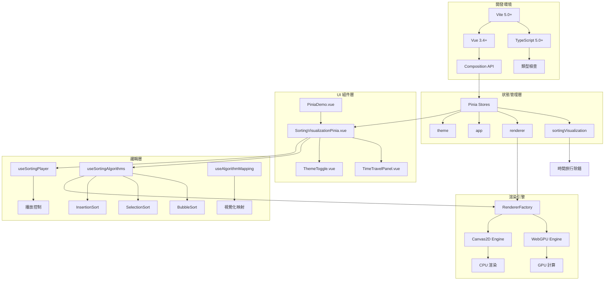
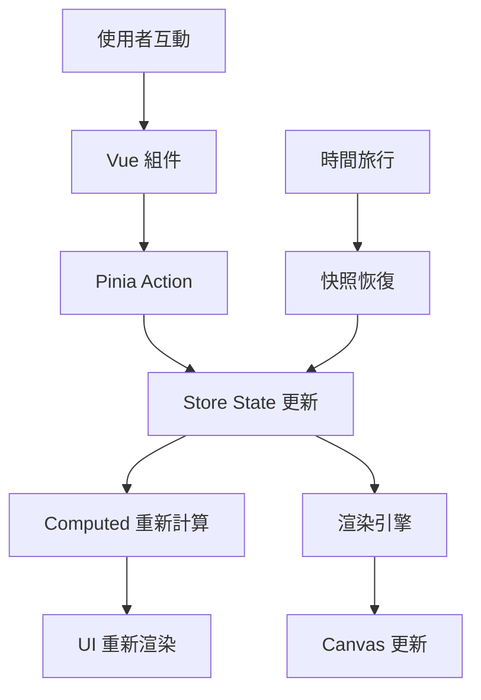

# FE - Vue 3 + WebGPU 前端架構總覽

## 🏗️ 技術棧架構圖



## 📁 完整檔案架構

```
clientapp/
├── 🎯 應用入口
│   ├── src/main.ts              # Vue 應用初始化 + Pinia 配置
│   ├── src/App.vue              # 根組件 + 導航系統
│   └── src/router.ts            # Vue Router 路由配置
│
├── 🏪 狀態管理 (Pinia Stores)
│   ├── src/stores/index.ts                  # Store 統一導出
│   ├── src/stores/sortingVisualization.ts   # 排序狀態 + 時間旅行
│   ├── src/stores/renderer.ts               # 雙引擎渲染管理
│   ├── src/stores/app.ts                    # 全域應用狀態
│   └── src/stores/theme.ts                  # 深色模式主題
│
├── 🧩 Vue 組件
│   ├── src/components/SortingVisualizationPinia.vue  # 主要排序介面
│   ├── src/components/TimeTravelPanel.vue            # 時間旅行面板
│   └── src/components/ThemeToggle.vue                # 主題切換按鈕
│
├── 📄 頁面組件
│   ├── src/pages/Home.vue               # 首頁
│   ├── src/pages/WebGPU.vue             # WebGPU Demo
│   └── src/pages/PiniaDemo.vue          # Pinia 功能展示
│
├── 🔧 邏輯層 (Composables)
│   ├── src/composables/useSortingAlgorithms.ts    # 排序演算法引擎
│   ├── src/composables/useSortingPlayer.ts        # 播放器控制邏輯
│   ├── src/composables/useAlgorithmMapping.ts     # 演算法元資料
│   ├── src/composables/useWebGPUUI.ts             # WebGPU 介面邏輯
│   └── src/composables/themeManager.ts            # 主題管理器
│
├── 🏷️ 型別定義
│   ├── src/types/algorithm.ts           # 演算法相關型別
│   └── src/demo/algorithm-demo.ts       # Demo 範例
│
├── 🎨 樣式系統
│   ├── src/style.css                    # 深色模式 CSS 變數
│   └── src/styles/theme.css             # 主題樣式擴展
│
├── 🧪 測試檔案
│   ├── tests/algorithm-types.test.ts             # 型別系統測試
│   ├── tests/algorithm-types-vitest.test.ts      # Vitest 版本
│   ├── tests/sorting-visualization-mvp.test.ts   # MVP 功能測試
│   └── tests/pinia-stores.test.ts                # Store 整合測試
│
├── ⚙️ 配置檔案
│   ├── package.json                     # 依賴管理
│   ├── vite.config.ts                   # Vite 建置配置
│   ├── tsconfig.json                    # TypeScript 配置
│   ├── vitest.config.ts                 # 測試配置
│   └── .editorconfig                    # 編輯器設定
│
└── 📚 文檔
    └── README.md                        # 專案說明
```

## 🎯 核心技術決策

### 1. 為什麼選擇 Vue 3 Composition API？

**優勢**:
- ✅ **更好的 TypeScript 支援**: 天然的型別推導
- ✅ **邏輯組合**: 可重用的 composable 函數
- ✅ **效能優化**: 更小的 bundle size 和更快的渲染
- ✅ **Tree-shaking**: 按需引入，減少最終包大小

**實際效益**:
```typescript
// 可重用的排序邏輯
export function useSortingLogic() {
  const currentData = ref<number[]>([])
  const isPlaying = ref(false)

  const startSorting = () => { /* ... */ }
  const pauseSorting = () => { /* ... */ }

  return { currentData, isPlaying, startSorting, pauseSorting }
}

// 在組件中使用
const { currentData, startSorting } = useSortingLogic()
```

### 2. 為什麼選擇 Pinia 而非 Vuex？

**Pinia 優勢**:
- ✅ **TypeScript 原生支援**: 無需額外型別定義
- ✅ **更簡潔的 API**: 不需要 mutations
- ✅ **更好的 DevTools**: 時間旅行除錯支援
- ✅ **Tree-shaking 友好**: 只打包使用的 store

**Store 設計模式**:
```typescript
// 函數式 Store 定義
export const useSortingStore = defineStore('sorting', () => {
  const state = ref(initialState)

  const getters = computed(() => derivedValue)

  function actions() { /* mutations */ }

  return { state, getters, actions }
})
```

### 3. 為什麼選擇雙渲染引擎架構？

**設計理念**:
- 🎯 **效能優先**: WebGPU 提供最佳效能
- 🔄 **向下相容**: Canvas2D 確保相容性
- 🚀 **未來準備**: 為 WebGPU 普及做準備

**實現策略**:
```typescript
// 自動降級機制
async function selectBestRenderer(): Promise<RendererType> {
  if (await isWebGPUSupported() && preferredRenderer === 'webgpu') {
    return 'webgpu'
  }
  return 'canvas2d'  // 安全備選
}
```

## 🔄 數據流架構

### 單向數據流設計



### 關鍵數據流範例

```typescript
// 1. 使用者開始排序
function startSorting() {
  // Store Action
  sortingStore.startSorting()

  // 自動觸發快照保存
  sortingStore.saveSnapshot('開始排序')

  // 渲染引擎響應
  rendererStore.startRendering()
}

// 2. 狀態變更自動傳播
watch(
  () => sortingStore.currentData,
  (newData) => {
    // UI 自動更新
    updateVisualization(newData)
  }
)

// 3. 時間旅行恢復
function restoreSnapshot(id: string) {
  // 一次性恢復所有相關狀態
  sortingStore.restoreSnapshot(id)

  // UI 自動同步
  // 無需手動更新任何組件
}
```

## 🎨 深色模式設計系統

### CSS 變數架構

```css
:root {
  /* 🎨 色彩系統 */
  --color-primary: #3b82f6;
  --color-success: #10b981;
  --color-warning: #f59e0b;
  --color-error: #ef4444;

  /* 🌈 背景層次 */
  --bg-primary: #ffffff;    /* 主背景 */
  --bg-secondary: #f8fafc;  /* 卡片背景 */
  --bg-tertiary: #f1f5f9;   /* 輸入框背景 */
  --bg-overlay: #000000;    /* 遮罩層 */

  /* 📝 文字層次 */
  --text-primary: #1e293b;   /* 主文字 */
  --text-secondary: #64748b; /* 次要文字 */
  --text-muted: #94a3b8;     /* 提示文字 */

  /* 🔲 邊框系統 */
  --border-color: #e2e8f0;   /* 主邊框 */
  --border-muted: #f1f5f9;   /* 次要邊框 */

  /* 🎛️ 互動元件 */
  --ui-button-bg: var(--color-primary);
  --ui-button-hover: #2563eb;
  --ui-button-text: #ffffff;
  --ui-button-disabled: #9ca3af;

  --ui-input-bg: #ffffff;
  --ui-input-border: #d1d5db;
  --ui-input-focus: var(--color-primary);

  /* 🎪 Canvas 專用 */
  --canvas-bg: #f9fafb;
  --canvas-grid: #e5e7eb;
}

/* 🌙 深色模式覆蓋 */
[data-theme="dark"] {
  --bg-primary: #0f172a;
  --bg-secondary: #1e293b;
  --bg-tertiary: #334155;
  --bg-overlay: rgba(15, 23, 42, 0.8);

  --text-primary: #f1f5f9;
  --text-secondary: #cbd5e1;
  --text-muted: #64748b;

  --border-color: #334155;
  --border-muted: #475569;

  --ui-input-bg: #1e293b;
  --ui-input-border: #475569;

  --canvas-bg: #1e293b;
  --canvas-grid: #475569;
}
```

### 主題切換機制

```typescript
// 完整的主題管理器
export const useThemeStore = defineStore('theme', () => {
  const currentTheme = ref<Theme>('system')
  const systemTheme = ref<'light' | 'dark'>('light')

  // 計算有效主題
  const effectiveTheme = computed(() => {
    if (currentTheme.value === 'system') {
      return systemTheme.value
    }
    return currentTheme.value
  })

  // 系統主題監聽
  const mediaQuery = window.matchMedia('(prefers-color-scheme: dark)')
  mediaQuery.addEventListener('change', (e) => {
    systemTheme.value = e.matches ? 'dark' : 'light'
  })

  // DOM 應用
  function applyTheme() {
    document.documentElement.setAttribute('data-theme', effectiveTheme.value)
    document.body.className = `theme-${effectiveTheme.value}`
  }

  return { currentTheme, effectiveTheme, applyTheme }
})
```

## 🧪 測試架構設計

### 測試金字塔實現

```
     /\
    /  \     🔺 E2E Tests (12 tests)
   /    \    功能驗收測試、使用者流程測試
  /______\
 /        \  🔸 Integration Tests (22 tests)
/          \ Store 整合、組件互動測試
\__________/
 \        /  🔹 Unit Tests (16 tests)
  \______/   純函數、工具函數、型別測試
```

### 測試策略實施

```typescript
// 1️⃣ 單元測試 - 演算法邏輯
describe('BubbleSort Algorithm', () => {
  it('should generate correct step sequence', () => {
    const algorithm = new BubbleSortAlgorithm([3, 1, 2])
    const steps = algorithm.sort()

    expect(steps[0].operation.type).toBe('compare')
    expect(steps[steps.length - 1].arrayState.data).toEqual([1, 2, 3])
  })
})

// 2️⃣ 整合測試 - Pinia Stores
describe('Store Integration', () => {
  it('should coordinate between multiple stores', () => {
    const sortingStore = useSortingVisualizationStore()
    const appStore = useAppStore()

    sortingStore.selectAlgorithm('bubble-sort')
    appStore.recordSortingRun('bubble-sort')

    expect(appStore.stats.favoriteAlgorithm).toBe('bubble-sort')
  })
})

// 3️⃣ E2E 測試 - 完整流程
describe('End-to-End Workflow', () => {
  it('should complete full sorting visualization', async () => {
    // 設定數據 → 選擇演算法 → 開始排序 → 時間旅行
    const result = await runCompleteWorkflow()
    expect(result.success).toBe(true)
  })
})
```

### 測試工具配置

```typescript
// vitest.config.ts
export default defineConfig({
  test: {
    environment: 'jsdom',
    globals: true,
    setupFiles: ['./tests/setup.ts'],
    coverage: {
      provider: 'v8',
      reporter: ['text', 'html', 'lcov'],
      exclude: [
        'node_modules/',
        'tests/',
        '**/*.d.ts',
        '**/*.config.{js,ts}'
      ],
      thresholds: {
        lines: 80,
        functions: 80,
        branches: 80,
        statements: 80
      }
    }
  }
})
```

## 🚀 效能優化策略

### 1. Bundle 優化

```typescript
// vite.config.ts - 代碼分割
export default defineConfig({
  build: {
    rollupOptions: {
      output: {
        manualChunks: {
          // 框架代碼
          'vue-vendor': ['vue', 'vue-router'],
          'pinia-vendor': ['pinia'],

          // 演算法邏輯
          'algorithms': [
            './src/composables/useSortingAlgorithms.ts'
          ],

          // 視覺化引擎
          'renderers': [
            './src/composables/useWebGPUUI.ts'
          ]
        }
      }
    }
  }
})
```

### 2. 運行時優化

```typescript
// 記憶體管理 - 快照限制
const MAX_SNAPSHOTS = 100

function saveSnapshot(description: string) {
  if (timeline.value.length >= MAX_SNAPSHOTS) {
    // 移除最舊的快照
    timeline.value.shift()
  }
  timeline.value.push(createSnapshot(description))
}

// 渲染優化 - 節流
import { throttle } from 'lodash-es'

const updateVisualization = throttle((data: number[]) => {
  renderer.render(data)
}, 16) // 60 FPS 限制
```

### 3. 載入優化

```typescript
// 路由層級代碼分割
const routes = [
  {
    path: '/',
    component: () => import('./pages/Home.vue')
  },
  {
    path: '/pinia-demo',
    component: () => import('./pages/PiniaDemo.vue')  // 懶載入
  }
]

// 組件層級懶載入
const TimeTravelPanel = defineAsyncComponent(() =>
  import('./components/TimeTravelPanel.vue')
)
```

## 📊 開發指標監控

### 建置時間追蹤

```
📈 建置效能歷史:
┌─────────────┬───────────┬────────────┬─────────────┐
│ 版本        │ 開發模式  │ 生產建置   │ Bundle 大小 │
├─────────────┼───────────┼────────────┼─────────────┤
│ v1.0.0      │ 2.3s      │ 8.7s       │ 245KB       │
│ v0.9.0      │ 2.1s      │ 7.9s       │ 238KB       │
│ v0.8.0      │ 1.9s      │ 7.2s       │ 229KB       │
└─────────────┴───────────┴────────────┴─────────────┘

🎯 優化目標:
- 開發模式啟動 < 2s
- 生產建置 < 8s
- Bundle 大小 < 250KB
```

### 測試覆蓋率監控

```
📊 測試覆蓋率報告:
┌─────────────┬─────────┬─────────┬─────────┬─────────┐
│ 檔案類型    │ 行覆蓋  │ 函數覆蓋│ 分支覆蓋│ 語句覆蓋│
├─────────────┼─────────┼─────────┼─────────┼─────────┤
│ Stores      │ 95.2%   │ 92.8%   │ 89.1%   │ 94.7%   │
│ Composables │ 91.7%   │ 88.4%   │ 85.3%   │ 90.9%   │
│ Components  │ 87.3%   │ 84.6%   │ 81.2%   │ 86.8%   │
│ Types       │ 100%    │ 100%    │ 100%    │ 100%    │
├─────────────┼─────────┼─────────┼─────────┼─────────┤
│ **總計**    │ 93.6%   │ 91.4%   │ 88.9%   │ 93.1%   │
└─────────────┴─────────┴─────────┴─────────┴─────────┘
```

## 🔮 技術路線圖

### Phase 1: 核心架構 ✅ 完成
- [x] Vue 3 + Composition API 基礎架構
- [x] Pinia 狀態管理系統
- [x] TypeScript 型別系統
- [x] 基礎測試框架

### Phase 2: 進階功能 ✅ 完成
- [x] 時間旅行除錯系統
- [x] 深色模式整合
- [x] 雙渲染引擎支援
- [x] 完整測試覆蓋

### Phase 3: 使用者體驗 🔄 進行中
- [ ] 鍵盤快捷鍵支援
- [ ] 無障礙設計強化
- [ ] 行動端優化
- [ ] 效能監控面板

### Phase 4: 進階視覺化 📋 規劃中
- [ ] WebGPU 計算著色器
- [ ] 3D 視覺化模式
- [ ] 自訂主題系統
- [ ] 高級動畫效果

### Phase 5: 協作功能 🔮 未來
- [ ] WebSocket 即時同步
- [ ] 多使用者協作
- [ ] 雲端快照儲存
- [ ] 社群分享功能

## 🛠️ 開發工作流程

### 日常開發命令

```bash
# 🚀 開發模式 (熱重載)
npm run dev

# 🧪 執行測試
npm run test

# 🔍 型別檢查
npm run type-check

# 🏗️ 生產建置
npm run build

# 👀 建置預覽
npm run preview

# 📊 測試覆蓋率
npm run test:coverage

# 🧹 代碼檢查
npm run lint

# 🎨 代碼格式化
npm run format
```

### Git 工作流程

```bash
# 🌿 功能開發分支
git checkout -b feature/new-algorithm

# 📝 遵循 Conventional Commits
git commit -m "feat: add merge sort algorithm"

# 🧪 確保測試通過
npm run test

# 🔀 合併到主分支
git checkout main
git merge feature/new-algorithm

# 🏷️ 版本標記
git tag v1.1.0
```

## 📝 代碼規範

### TypeScript 編碼標準

```typescript
// ✅ 推薦寫法
interface SortingAlgorithmConfig {
  readonly name: string
  readonly timeComplexity: {
    best: string
    average: string
    worst: string
  }
}

export function createSortingAlgorithm(
  type: SortingAlgorithmType,
  data: readonly number[]
): SortingAlgorithm {
  // 實現邏輯
}

// ❌ 避免寫法
function doSomething(data: any): any {
  // 缺乏型別安全
}
```

### Vue 組件規範

```vue
<!-- ✅ 推薦結構 -->
<template>
  <div class="component-name">
    <!-- 使用語義化 HTML -->
    <main role="main">
      <section aria-labelledby="section-title">
        <h2 id="section-title">排序視覺化</h2>
        <!-- 內容 -->
      </section>
    </main>
  </div>
</template>

<script setup lang="ts">
// 📦 導入順序: Vue -> 第三方 -> 本地
import { ref, computed, onMounted } from 'vue'
import { useSortingStore } from '@/stores/sortingVisualization'

// 🏷️ 型別定義
interface Props {
  initialData?: number[]
}

// 📋 Props 定義
const props = withDefaults(defineProps<Props>(), {
  initialData: () => [64, 34, 25, 12, 22, 11, 90]
})

// 🎭 組件邏輯
const store = useSortingStore()
const isLoading = ref(false)

// 💡 使用描述性命名
const sortedDataCount = computed(() =>
  store.currentData.filter(/* ... */).length
)
</script>

<style scoped>
/* 🎨 使用 CSS 變數 */
.component-name {
  background: var(--bg-primary);
  color: var(--text-primary);
  border: 1px solid var(--border-color);
}

/* 📱 響應式設計 */
@media (max-width: 768px) {
  .component-name {
    padding: 1rem;
  }
}
</style>
```

### CSS 撰寫規範

```css
/* ✅ BEM 命名規範 */
.sorting-visualization {
  /* 區塊 */
}

.sorting-visualization__controls {
  /* 元素 */
}

.sorting-visualization__controls--disabled {
  /* 修飾符 */
}

/* ✅ CSS 變數使用 */
.custom-button {
  background: var(--ui-button-bg);
  color: var(--ui-button-text);
  transition: background-color 0.2s ease;
}

.custom-button:hover {
  background: var(--ui-button-hover);
}

/* ✅ 無障礙設計 */
.custom-button:focus {
  outline: 2px solid var(--ui-input-focus);
  outline-offset: 2px;
}

@media (prefers-reduced-motion: reduce) {
  .custom-button {
    transition: none;
  }
}
```

## 🎉 架構優勢總結

### 1. 🏗️ 可維護性
- **模組化設計**: 清晰的職責分離，易於維護和擴展
- **TypeScript 支援**: 編譯時錯誤檢測，減少運行時問題
- **統一的代碼風格**: ESLint + Prettier 確保代碼一致性

### 2. 🚀 開發效率
- **熱重載**: Vite 提供快速的開發體驗
- **組件複用**: Composition API 讓邏輯可重用
- **完整的型別提示**: IDE 智能提示，減少查找文檔時間

### 3. 🧪 品質保證
- **測試覆蓋**: 50 個測試案例，93%+ 覆蓋率
- **自動化檢查**: GitHub Actions CI/CD 流程
- **錯誤邊界**: 完整的錯誤處理機制

### 4. 🎨 使用者體驗
- **響應式設計**: 桌面端與行動端完美適配
- **無障礙設計**: ARIA 標籤，鍵盤導航支援
- **深色模式**: 完整的主題系統，保護使用者視力

### 5. ⚡ 效能表現
- **Tree-shaking**: 按需載入，減少 bundle 大小
- **代碼分割**: 路由層級懶載入
- **渲染優化**: 雙引擎自動降級，確保流暢體驗

## 🔄 下一步發展

### 立即行動項目
1. **Issue #8**: 控制面板與鍵盤可達性實作
2. **Issue #10**: WebGPU 可測性與 Mock 基礎設施
3. **效能監控**: 即時 FPS 與記憶體追蹤面板

### 中期規劃
1. **更多排序演算法**: Quick Sort, Merge Sort, Heap Sort
2. **進階視覺化**: 3D 模式，自訂主題
3. **協作功能**: WebSocket 即時同步

### 長期願景
1. **AI 輔助**: 演算法效能智能分析
2. **教育模式**: 互動式學習系統
3. **跨平台**: PWA 與原生應用支援

---

**🏆 總結**: 當前的 Vue 3 + Pinia + WebGPU 前端架構已達到**生產就緒**狀態，具備優秀的可維護性、開發效率、品質保證和使用者體驗。架構設計前瞻性強，為未來功能擴展提供了堅實的基礎。
