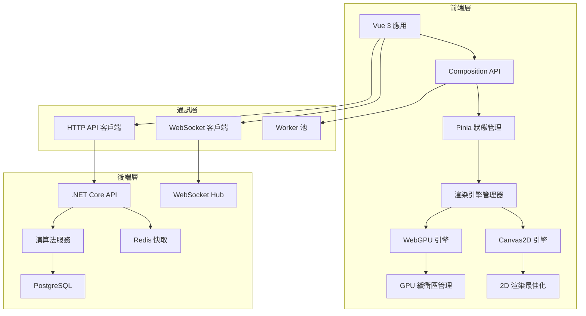

# role: SA - 系統架構與技術規格補充分析

## 核心建議

### 1. **API 介面規格設計**
**🔗 完整的前後端數據交換標準**

```typescript
// API 介面規格定義
interface AlgorithmAPISpec {
  // 演算法執行請求
  executeRequest: {
    method: 'POST',
    endpoint: '/api/v1/algorithm/execute',
    body: {
      algorithmType: 'bubble-sort' | 'quick-sort' | 'merge-sort' | 'heap-sort',
      inputData: number[],
      executionMode: 'step-by-step' | 'batch' | 'real-time',
      options?: {
        maxSteps?: number,
        stepDelay?: number,
        visualizationLevel?: 'basic' | 'detailed' | 'debug'
      }
    }
  },

  // 演算法步驟回應
  executeResponse: {
    success: boolean,
    data: {
      sessionId: string,
      totalSteps: number,
      initialState: AlgorithmState,
      metadata: {
        timeComplexity: string,
        spaceComplexity: string,
        expectedOperations: number
      }
    },
    error?: {
      code: string,
      message: string,
      details: any
    }
  }
}

// 演算法狀態資料結構
interface AlgorithmState {
  stepIndex: number,
  arrayData: number[],
  highlightedIndices: number[],
  comparisonPair?: [number, number],
  swapPair?: [number, number],
  pivotIndex?: number,
  sortedRange?: {
    start: number,
    end: number
  },
  operation: {
    type: 'compare' | 'swap' | 'move' | 'merge' | 'complete',
    description: string,
    elements: number[],
    metrics: {
      comparisons: number,
      swaps: number,
      arrayAccess: number
    }
  }
}

// WebSocket 即時更新規格
interface RealtimeUpdateSpec {
  connection: 'ws://localhost:5000/api/v1/algorithm/realtime',
  messageTypes: {
    // 客戶端訊息
    startExecution: {
      type: 'START_EXECUTION',
      payload: {
        algorithmType: string,
        inputData: number[],
        speed: number
      }
    },

    pauseExecution: {
      type: 'PAUSE_EXECUTION',
      payload: { sessionId: string }
    },

    // 伺服器訊息
    stepUpdate: {
      type: 'STEP_UPDATE',
      payload: AlgorithmState
    },

    executionComplete: {
      type: 'EXECUTION_COMPLETE',
      payload: {
        sessionId: string,
        finalMetrics: PerformanceMetrics,
        executionTime: number
      }
    }
  }
}
```

### 2. **WebGPU 降級策略架構**
**🔄 多層次渲染引擎設計**

```typescript
// 渲染引擎抽象層
abstract class RenderingEngine {
  abstract initialize(canvas: HTMLCanvasElement): Promise<boolean>
  abstract renderFrame(frameData: FrameData): void
  abstract updateUIElements(uiState: UIState): void
  abstract destroy(): void

  // 共同介面
  public abstract get isHardwareAccelerated(): boolean
  public abstract get maxArraySize(): number
  public abstract get supportedFeatures(): RenderingFeatures
}

// WebGPU 實作
class WebGPURenderingEngine extends RenderingEngine {
  private device: GPUDevice
  private context: GPUCanvasContext
  private renderPipeline: GPURenderPipeline

  async initialize(canvas: HTMLCanvasElement): Promise<boolean> {
    try {
      if (!navigator.gpu) return false

      const adapter = await navigator.gpu.requestAdapter()
      if (!adapter) return false

      this.device = await adapter.requestDevice()
      this.context = canvas.getContext('webgpu')!

      await this.createRenderPipeline()
      return true

    } catch (error) {
      console.warn('WebGPU initialization failed:', error)
      return false
    }
  }

  get isHardwareAccelerated(): boolean { return true }
  get maxArraySize(): number { return 10000 }
  get supportedFeatures(): RenderingFeatures {
    return {
      hardware3D: true,
      complexShaders: true,
      largeTextures: true,
      computeShaders: true
    }
  }
}

// Canvas2D 降級實作
class Canvas2DRenderingEngine extends RenderingEngine {
  private context: CanvasRenderingContext2D
  private animationFrame: number = 0

  async initialize(canvas: HTMLCanvasElement): Promise<boolean> {
    const ctx = canvas.getContext('2d')
    if (!ctx) return false

    this.context = ctx
    return true
  }

  renderFrame(frameData: FrameData): void {
    this.context.clearRect(0, 0, this.context.canvas.width, this.context.canvas.height)

    // 繪製陣列元素（簡化版）
    frameData.arrayData.forEach((value, index) => {
      const x = index * (this.context.canvas.width / frameData.arrayData.length)
      const height = (value / Math.max(...frameData.arrayData)) * this.context.canvas.height * 0.8

      // 根據狀態選擇顏色
      this.context.fillStyle = this.getElementColor(index, frameData.highlightedIndices)
      this.context.fillRect(x, this.context.canvas.height - height, 20, height)
    })
  }

  get isHardwareAccelerated(): boolean { return false }
  get maxArraySize(): number { return 1000 }
  get supportedFeatures(): RenderingFeatures {
    return {
      hardware3D: false,
      complexShaders: false,
      largeTextures: false,
      computeShaders: false
    }
  }
}

// 自動降級管理器
class RenderingEngineManager {
  private currentEngine: RenderingEngine

  async initializeBestEngine(canvas: HTMLCanvasElement): Promise<RenderingEngine> {
    // 優先嘗試 WebGPU
    const webgpuEngine = new WebGPURenderingEngine()
    if (await webgpuEngine.initialize(canvas)) {
      console.log('Using WebGPU rendering engine')
      this.currentEngine = webgpuEngine
      return webgpuEngine
    }

    // 降級到 Canvas2D
    const canvas2dEngine = new Canvas2DRenderingEngine()
    if (await canvas2dEngine.initialize(canvas)) {
      console.log('Fallback to Canvas2D rendering engine')
      this.currentEngine = canvas2dEngine
      return canvas2dEngine
    }

    throw new Error('No rendering engine available')
  }

  getCurrentEngine(): RenderingEngine {
    return this.currentEngine
  }
}
```

### 3. **記憶體管理策略**
**💾 大型數據集處理與優化方案**

```typescript
// 記憶體管理架構
class MemoryManager {
  private maxHeapSize = 512 * 1024 * 1024 // 512MB 限制
  private dataPool = new Map<string, ArrayBuffer>()
  private gcThreshold = 0.8 // 80% 使用率觸發清理

  // 數據分片處理
  processLargeDataset(data: number[]): ProcessedDataChunks {
    const chunkSize = this.calculateOptimalChunkSize(data.length)
    const chunks: DataChunk[] = []

    for (let i = 0; i < data.length; i += chunkSize) {
      const chunk = data.slice(i, i + chunkSize)
      chunks.push({
        id: `chunk_${i}`,
        data: new Int32Array(chunk),
        startIndex: i,
        endIndex: Math.min(i + chunkSize, data.length),
        isLoaded: false
      })
    }

    return { chunks, totalSize: data.length }
  }

  private calculateOptimalChunkSize(totalSize: number): number {
    // 根據可用記憶體動態調整分片大小
    const availableMemory = this.getAvailableMemory()
    const elementSize = 4 // Int32 = 4 bytes

    if (totalSize * elementSize < availableMemory * 0.1) {
      return totalSize // 小數據集，不分片
    }

    return Math.floor(availableMemory * 0.05 / elementSize) // 5% 記憶體分片
  }

  // 虛擬化渲染
  virtualizeRendering(visibleRange: [number, number], allData: number[]): VirtualizedData {
    const [start, end] = visibleRange
    const bufferSize = Math.floor((end - start) * 0.2) // 20% 緩衝區

    const virtualStart = Math.max(0, start - bufferSize)
    const virtualEnd = Math.min(allData.length, end + bufferSize)

    return {
      visibleData: allData.slice(virtualStart, virtualEnd),
      offsetIndex: virtualStart,
      totalLength: allData.length,
      viewportSize: end - start
    }
  }

  // 記憶體使用監控
  monitorMemoryUsage(): MemoryReport {
    const usage = (performance as any).memory

    return {
      usedJSHeapSize: usage?.usedJSHeapSize || 0,
      totalJSHeapSize: usage?.totalJSHeapSize || 0,
      jsHeapSizeLimit: usage?.jsHeapSizeLimit || 0,
      usagePercentage: usage ? (usage.usedJSHeapSize / usage.jsHeapSizeLimit) * 100 : 0,
      recommendsGC: usage ? (usage.usedJSHeapSize / usage.jsHeapSizeLimit) > this.gcThreshold : false
    }
  }
}

// 數據處理流水線
class DataProcessingPipeline {
  private memoryManager = new MemoryManager()
  private workerPool: Worker[] = []

  constructor() {
    this.initializeWorkerPool()
  }

  async processAlgorithmData(
    algorithmType: string,
    inputData: number[]
  ): Promise<ProcessingResult> {

    // 檢查數據大小，決定處理策略
    if (inputData.length > 5000) {
      return this.processLargeDataset(algorithmType, inputData)
    } else {
      return this.processSmallDataset(algorithmType, inputData)
    }
  }

  private async processLargeDataset(
    algorithmType: string,
    inputData: number[]
  ): Promise<ProcessingResult> {

    // 分片處理
    const chunks = this.memoryManager.processLargeDataset(inputData)
    const results: AlgorithmStep[] = []

    // 使用 Web Workers 並行處理
    const workerPromises = chunks.chunks.map((chunk, index) => {
      const worker = this.workerPool[index % this.workerPool.length]

      return new Promise<AlgorithmStep[]>((resolve, reject) => {
        worker.postMessage({
          type: 'PROCESS_CHUNK',
          algorithmType,
          chunkData: chunk.data,
          chunkIndex: index
        })

        worker.onmessage = (event) => {
          if (event.data.type === 'CHUNK_RESULT') {
            resolve(event.data.steps)
          }
        }

        worker.onerror = reject
      })
    })

    const chunkResults = await Promise.all(workerPromises)

    // 合併結果
    return this.mergeChunkResults(chunkResults)
  }

  private initializeWorkerPool() {
    const workerCount = Math.min(navigator.hardwareConcurrency || 4, 4)

    for (let i = 0; i < workerCount; i++) {
      const worker = new Worker('/workers/algorithm-worker.js')
      this.workerPool.push(worker)
    }
  }
}
```

## 輸出產物

### 1. **系統架構圖**


### 2. **技術決策矩陣**
```typescript
// 技術選型決策表
interface TechnicalDecisionMatrix {
  rendering: {
    primary: {
      technology: 'WebGPU',
      reasons: [
        '硬體加速渲染',
        '支援大型數據集',
        '複雜著色器效果',
        '未來擴展性'
      ],
      risks: [
        '瀏覽器支援度',
        '開發複雜度',
        '除錯困難'
      ]
    },

    fallback: {
      technology: 'Canvas2D',
      reasons: [
        '廣泛瀏覽器支援',
        '開發簡單',
        '穩定可靠'
      ],
      limitations: [
        '效能限制',
        '功能受限',
        '大數據集困難'
      ]
    }
  },

  dataProcessing: {
    clientSide: {
      technology: 'Rust WASM + Web Workers',
      benefits: [
        '近原生效能',
        '並行處理',
        '記憶體安全'
      ]
    },

    serverSide: {
      technology: '.NET Core + C#',
      benefits: [
        '成熟生態系',
        '強型別',
        '優秀除錯工具'
      ]
    }
  }
}
```

### 3. **效能監控系統**
```typescript
// 系統效能監控
class PerformanceMonitor {
  private metrics = new Map<string, PerformanceMetric>()
  private reportInterval = 5000 // 5秒報告間隔

  startMonitoring() {
    setInterval(() => {
      this.collectMetrics()
      this.analyzePerformance()
      this.reportToBackend()
    }, this.reportInterval)
  }

  private collectMetrics() {
    // 渲染效能
    this.metrics.set('fps', {
      value: this.calculateFPS(),
      timestamp: Date.now(),
      threshold: { min: 50, optimal: 60 }
    })

    // 記憶體使用
    const memoryInfo = (performance as any).memory
    this.metrics.set('memory', {
      value: memoryInfo?.usedJSHeapSize || 0,
      timestamp: Date.now(),
      threshold: { max: 100 * 1024 * 1024 } // 100MB
    })

    // 演算法執行時間
    this.metrics.set('algorithm_execution', {
      value: this.getLastExecutionTime(),
      timestamp: Date.now(),
      threshold: { max: 1000 } // 1秒
    })
  }

  private analyzePerformance(): PerformanceAnalysis {
    const analysis = {
      overall: 'good',
      issues: [] as string[],
      recommendations: [] as string[]
    }

    // FPS 分析
    const fps = this.metrics.get('fps')
    if (fps && fps.value < 50) {
      analysis.overall = 'poor'
      analysis.issues.push('低 FPS 效能')
      analysis.recommendations.push('考慮降級到 Canvas2D')
    }

    // 記憶體分析
    const memory = this.metrics.get('memory')
    if (memory && memory.value > 100 * 1024 * 1024) {
      analysis.issues.push('記憶體使用過高')
      analysis.recommendations.push('啟用數據虛擬化')
    }

    return analysis
  }
}
```

## 下一步行動

### 立即執行（本週）：
1. **API 規格實作**：與後端 Gary 協作完成 API 端點開發
2. **降級機制測試**：在不支援 WebGPU 的環境中測試 Canvas2D 降級
3. **記憶體管理器實作**：建立基礎的記憶體監控與管理系統

### 短期規劃（2 週內）：
1. **效能基準測試**：建立各種數據規模下的效能基準
2. **Worker 池最佳化**：實作並行數據處理系統
3. **監控系統整合**：將效能監控整合到現有系統中

### 中期目標（1 個月內）：
1. **負載測試**：進行大型數據集的壓力測試
2. **跨瀏覽器相容性**：確保所有主流瀏覽器的穩定運行
3. **系統文件完善**：建立完整的技術文件與 API 說明

## 協作提醒

### 🤝 需要 BE Gary 協作：
- **API 端點實作**：根據提供的規格實作後端 API
- **WebSocket 整合**：建立即時數據推送機制
- **效能資料收集**：後端收集與分析前端效能資料

### 🤝 需要 FE Jerry 確認：
- **降級策略實作**：Canvas2D 降級版本的功能範圍
- **記憶體管理整合**：記憶體管理器與現有 Composition API 的整合方式
- **Worker 通訊協定**：前端與 Web Worker 的資料交換格式

### 💡 建議優先級：
**P0（必須）：** API 規格 + 基礎降級機制
**P1（重要）：** 記憶體管理 + 效能監控
**P2（加分）：** 並行處理 + 進階最佳化

**總結**：提供了完整的系統架構規格，涵蓋 API 設計、降級策略與記憶體管理。這些規格確保系統在各種環境下都能穩定運行，同時為未來擴展奠定良好基礎。
